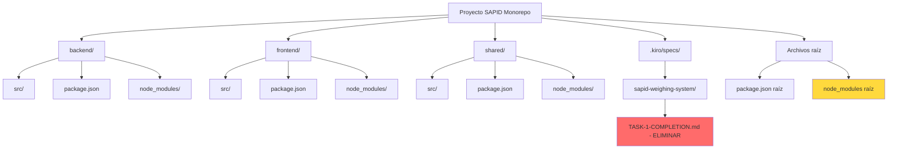

# Documento de Diseño: Limpieza del Proyecto SAPID

## Overview

Este diseño documenta la limpieza y optimización del proyecto SAPID (Sistema Automatizado de Pesaje e Integración Digital). El objetivo es eliminar archivos innecesarios, optimizar la estructura del monorepo, eliminar duplicaciones de dependencias, y mantener solo los elementos esenciales para el funcionamiento del sistema.

El proyecto SAPID es un monorepo con tres paquetes principales: backend (Node.js/Express), frontend (Next.js), y shared (tipos TypeScript compartidos). Actualmente contiene archivos de documentación temporal, posibles duplicaciones de dependencias entre el package.json raíz y los paquetes individuales, y potencialmente configuraciones redundantes.

## Arquitectura



## Componentes y Interfaces

### Componente 1: Análisis de Archivos Innecesarios

**Propósito**: Identificar y eliminar archivos que ya no son necesarios para el funcionamiento del sistema.

**Archivos a Eliminar**:

```typescript
interface ArchivoInnecesario {
  ruta: string
  razon: string
  impacto: 'ninguno' | 'bajo' | 'medio'
}

const archivosAEliminar: ArchivoInnecesario[] = [
  {
    ruta: '.kiro/specs/sapid-weighing-system/TASK-1-COMPLETION.md',
    razon: 'Archivo de documentación temporal que documenta la completitud de la Tarea 1. Ya no se necesita.',
    impacto: 'ninguno'
  }
]
```

**Criterios de Eliminación**:
- Archivos de documentación temporal o de progreso
- Archivos de test vacíos o sin implementación real
- Archivos de configuración duplicados
- Archivos generados que pueden recrearse

### Componente 2: Optimización de Dependencias

**Propósito**: Analizar y optimizar la estructura de dependencias del monorepo para eliminar duplicaciones.

**Estrategia de Dependencias**:

```typescript
interface EstrategiaDependencias {
  ubicacion: 'raiz' | 'paquete'
  tipo: 'dependencies' | 'devDependencies'
  razon: string
}

// Dependencias de desarrollo compartidas → package.json raíz
const devDependenciasCompartidas = [
  'typescript',
  'eslint',
  '@typescript-eslint/eslint-plugin',
  '@typescript-eslint/parser',
  'vitest',
  '@vitest/coverage-v8',
  'prettier'
]

// Dependencias específicas de runtime → package.json de cada paquete
const dependenciasEspecificas = {
  backend: ['express', 'sequelize', 'pg', 'bcrypt', 'jsonwebtoken', 'serialport'],
  frontend: ['next', 'react', 'react-dom', 'axios', 'tailwindcss'],
  shared: [] // Solo tipos, sin dependencias de runtime
}
```

**Análisis Actual**:

1. **package.json raíz**: Contiene TODAS las dependencias (runtime + dev) mezcladas
2. **backend/package.json**: Contiene sus propias dependencias
3. **frontend/package.json**: Contiene solo scripts, sin dependencias declaradas
4. **shared/package.json**: Contiene solo devDependencies

**Problema Identificado**: El package.json raíz tiene dependencias de runtime (express, react, next, etc.) que deberían estar solo en los paquetes específicos.

### Componente 3: Gestión de node_modules

**Propósito**: Optimizar la estructura de node_modules en el monorepo.

**Estrategia**:

```typescript
interface EstrategiaNodeModules {
  enfoque: 'workspaces' | 'independiente'
  ubicacion: string
  accion: 'mantener' | 'eliminar' | 'recrear'
}

const estrategia: EstrategiaNodeModules[] = [
  {
    enfoque: 'workspaces',
    ubicacion: 'node_modules/ (raíz)',
    accion: 'mantener' // Si se usan npm workspaces
  },
  {
    enfoque: 'independiente',
    ubicacion: 'backend/node_modules/',
    accion: 'mantener'
  },
  {
    enfoque: 'independiente',
    ubicacion: 'frontend/node_modules/',
    accion: 'mantener'
  },
  {
    enfoque: 'independiente',
    ubicacion: 'shared/node_modules/',
    accion: 'mantener'
  }
]
```

**Análisis**: El proyecto NO está configurado como npm workspace (no hay campo "workspaces" en package.json raíz), por lo tanto cada paquete gestiona sus propias dependencias de forma independiente.

**Recomendación**: El node_modules raíz puede contener dependencias de desarrollo compartidas (concurrently, prettier) pero NO debería tener dependencias de runtime de los paquetes individuales.

### Componente 4: Limpieza de Archivos de Test

**Propósito**: Identificar archivos de test vacíos o sin implementación real.

**Análisis de Tests Existentes**:

```typescript
interface ArchivoTest {
  ruta: string
  estado: 'implementado' | 'vacio' | 'parcial'
  accion: 'mantener' | 'eliminar' | 'completar'
}

const archivosTest: ArchivoTest[] = [
  {
    ruta: 'backend/src/repositories/UsuarioRepository.test.ts',
    estado: 'parcial', // Necesita verificación
    accion: 'mantener'
  },
  {
    ruta: 'backend/src/services/AuthService.test.ts',
    estado: 'parcial',
    accion: 'mantener'
  },
  {
    ruta: 'backend/src/services/AuthService.pbt.test.ts',
    estado: 'parcial',
    accion: 'mantener'
  },
  {
    ruta: 'frontend/src/test/setup.ts',
    estado: 'implementado',
    accion: 'mantener'
  }
]
```

### Componente 5: Configuraciones Duplicadas

**Propósito**: Identificar y consolidar configuraciones duplicadas.

**Configuraciones a Revisar**:

```typescript
interface ConfiguracionDuplicada {
  archivo: string
  ubicaciones: string[]
  accion: 'consolidar' | 'mantener_separadas'
  razon: string
}

const configuraciones: ConfiguracionDuplicada[] = [
  {
    archivo: 'tsconfig.json',
    ubicaciones: ['backend/', 'frontend/', 'shared/'],
    accion: 'mantener_separadas',
    razon: 'Cada paquete tiene necesidades específicas de compilación TypeScript'
  },
  {
    archivo: '.eslintrc.json',
    ubicaciones: ['backend/', 'frontend/'],
    accion: 'mantener_separadas',
    razon: 'Backend y frontend tienen reglas de linting diferentes'
  },
  {
    archivo: 'vitest.config.ts',
    ubicaciones: ['backend/', 'frontend/'],
    accion: 'mantener_separadas',
    razon: 'Configuraciones de test específicas para cada entorno'
  }
]
```

## Algoritmos de Limpieza

### Algoritmo 1: Eliminación de Archivos Innecesarios

```typescript
ALGORITHM eliminarArchivosInnecesarios
INPUT: listaArchivos: ArchivoInnecesario[]
OUTPUT: resultado: ResultadoLimpieza

BEGIN
  resultado ← {eliminados: [], errores: []}
  
  FOR EACH archivo IN listaArchivos DO
    IF archivo.impacto = 'ninguno' OR confirmarEliminacion(archivo) THEN
      TRY
        eliminarArchivo(archivo.ruta)
        resultado.eliminados.add(archivo.ruta)
        registrarLog('Eliminado: ' + archivo.ruta + ' - ' + archivo.razon)
      CATCH error
        resultado.errores.add({archivo: archivo.ruta, error: error.message})
      END TRY
    END IF
  END FOR
  
  RETURN resultado
END
```

**Precondiciones**:
- Los archivos a eliminar existen en el sistema de archivos
- Se tienen permisos de escritura en los directorios

**Postcondiciones**:
- Los archivos innecesarios han sido eliminados
- Se ha registrado un log de todas las operaciones
- Los errores han sido capturados y reportados

### Algoritmo 2: Optimización de Dependencias

```typescript
ALGORITHM optimizarDependencias
INPUT: packageJsonRaiz: PackageJson, packageJsons: PackageJson[]
OUTPUT: packageJsonsOptimizados: PackageJson[]

BEGIN
  // Paso 1: Identificar dependencias de desarrollo compartidas
  devDepsCompartidas ← identificarDevDepsCompartidas(packageJsons)
  
  // Paso 2: Mover devDependencies compartidas a la raíz
  packageJsonRaiz.devDependencies ← devDepsCompartidas
  
  // Paso 3: Eliminar devDependencies duplicadas de paquetes individuales
  FOR EACH pkg IN packageJsons DO
    FOR EACH dep IN devDepsCompartidas DO
      IF dep IN pkg.devDependencies THEN
        eliminar dep de pkg.devDependencies
      END IF
    END FOR
  END FOR
  
  // Paso 4: Eliminar dependencias de runtime del package.json raíz
  dependenciasRuntime ← ['express', 'react', 'next', 'sequelize', 'pg', ...]
  FOR EACH dep IN dependenciasRuntime DO
    IF dep IN packageJsonRaiz.dependencies THEN
      eliminar dep de packageJsonRaiz.dependencies
    END IF
  END FOR
  
  // Paso 5: Asegurar que cada paquete tenga sus dependencias de runtime
  FOR EACH pkg IN packageJsons DO
    verificarDependenciasRuntime(pkg)
  END FOR
  
  RETURN packageJsonsOptimizados
END
```

**Precondiciones**:
- Todos los archivos package.json son válidos y parseables
- Se conocen las dependencias de runtime de cada paquete

**Postcondiciones**:
- Las devDependencies compartidas están solo en la raíz
- Las dependencias de runtime están solo en los paquetes que las usan
- No hay duplicaciones innecesarias
- Todos los paquetes pueden instalarse y ejecutarse correctamente

### Algoritmo 3: Verificación de Integridad Post-Limpieza

```typescript
ALGORITHM verificarIntegridad
INPUT: proyecto: ProyectoSAPID
OUTPUT: resultado: ResultadoVerificacion

BEGIN
  resultado ← {valido: true, errores: []}
  
  // Verificar que los archivos esenciales existen
  archivosEsenciales ← [
    'package.json',
    'backend/package.json',
    'backend/src/index.ts',
    'frontend/package.json',
    'frontend/src/app/page.tsx',
    'shared/package.json',
    'shared/src/index.ts',
    '.kiro/specs/sapid-weighing-system/requirements.md',
    '.kiro/specs/sapid-weighing-system/design.md',
    '.kiro/specs/sapid-weighing-system/tasks.md'
  ]
  
  FOR EACH archivo IN archivosEsenciales DO
    IF NOT existe(archivo) THEN
      resultado.valido ← false
      resultado.errores.add('Archivo esencial faltante: ' + archivo)
    END IF
  END FOR
  
  // Verificar que los package.json son válidos
  FOR EACH pkgJson IN obtenerTodosPackageJson() DO
    IF NOT esJSONValido(pkgJson) THEN
      resultado.valido ← false
      resultado.errores.add('package.json inválido: ' + pkgJson.ruta)
    END IF
  END FOR
  
  // Verificar que no hay dependencias rotas
  FOR EACH paquete IN ['backend', 'frontend', 'shared'] DO
    dependenciasRotas ← verificarDependencias(paquete)
    IF dependenciasRotas.length > 0 THEN
      resultado.valido ← false
      resultado.errores.add('Dependencias rotas en ' + paquete + ': ' + dependenciasRotas)
    END IF
  END FOR
  
  RETURN resultado
END
```

**Precondiciones**:
- El proyecto existe en el sistema de archivos
- Se tienen permisos de lectura en todos los directorios

**Postcondiciones**:
- Se ha verificado la existencia de todos los archivos esenciales
- Se ha validado la sintaxis de todos los package.json
- Se han identificado todas las dependencias rotas
- Se ha generado un reporte completo de integridad

## Ejemplo de Uso

### Caso 1: Eliminación de TASK-1-COMPLETION.md

```typescript
// Paso 1: Identificar el archivo
const archivo = {
  ruta: '.kiro/specs/sapid-weighing-system/TASK-1-COMPLETION.md',
  razon: 'Documentación temporal de completitud de tarea',
  impacto: 'ninguno'
}

// Paso 2: Eliminar el archivo
eliminarArchivo(archivo.ruta)

// Paso 3: Verificar eliminación
if (!existe(archivo.ruta)) {
  console.log('✓ Archivo eliminado exitosamente')
}
```

### Caso 2: Optimización de package.json raíz

```typescript
// Estado actual (simplificado)
const packageJsonRaizActual = {
  dependencies: {
    express: '^4.18.2',      // ❌ Debería estar solo en backend
    react: '^18.2.0',        // ❌ Debería estar solo en frontend
    next: '^14.0.4',         // ❌ Debería estar solo en frontend
    // ... más dependencias de runtime
  },
  devDependencies: {
    typescript: '^5.3.3',
    concurrently: '^8.2.2',
    prettier: '^3.1.1'
  }
}

// Estado optimizado
const packageJsonRaizOptimizado = {
  dependencies: {
    // Solo dependencias necesarias para scripts raíz
  },
  devDependencies: {
    // Herramientas de desarrollo compartidas
    typescript: '^5.3.3',
    eslint: '^8.56.0',
    '@typescript-eslint/eslint-plugin': '^6.17.0',
    '@typescript-eslint/parser': '^6.17.0',
    vitest: '^1.1.1',
    '@vitest/coverage-v8': '^1.1.1',
    prettier: '^3.1.1',
    concurrently: '^8.2.2'
  }
}
```

### Caso 3: Verificación de Integridad

```typescript
// Ejecutar verificación después de la limpieza
const resultado = verificarIntegridad(proyectoSAPID)

if (resultado.valido) {
  console.log('✓ Proyecto limpio y funcional')
  console.log('  - Archivos esenciales: OK')
  console.log('  - package.json válidos: OK')
  console.log('  - Dependencias: OK')
} else {
  console.error('✗ Problemas detectados:')
  resultado.errores.forEach(error => console.error('  -', error))
}
```

## Propiedades de Corrección

*Una propiedad es una característica o comportamiento que debe mantenerse verdadero en todas las ejecuciones válidas del sistema - esencialmente, una declaración formal sobre lo que el sistema debe hacer. Las propiedades sirven como puente entre las especificaciones legibles por humanos y las garantías de corrección verificables por máquina.*

### Property 1: Eliminación de archivos innecesarios

*Para cualquier* archivo marcado como innecesario con impacto 'ninguno', el Sistema_Limpieza debe eliminarlo del sistema de archivos y el archivo no debe existir después de la operación.

**Valida: Requisitos 1.1**

### Property 2: Registro completo de operaciones

*Para cualquier* operación realizada por el Sistema_Limpieza (eliminación de archivo, modificación de package.json, error encontrado), el sistema debe registrar en el log: timestamp, tipo de operación, detalles específicos (ruta, cambios, contexto), y resultado de la operación.

**Valida: Requisitos 1.2, 9.1, 9.2, 9.3, 9.4**

### Property 3: Manejo robusto de errores de eliminación

*Para cualquier* error al eliminar un archivo (permisos insuficientes, archivo en uso, u otro error), el Sistema_Limpieza debe capturar el error, registrarlo en el log, y continuar procesando los demás archivos sin detener la ejecución.

**Valida: Requisitos 1.3, 7.1, 7.2**

### Property 4: Reporte completo de resultados

*Para cualquier* ejecución del proceso de limpieza, el Sistema_Limpieza debe generar un reporte que contenga: lista de archivos eliminados exitosamente, lista de errores encontrados con detalles, y sugerencias para resolución manual cuando sea necesario.

**Valida: Requisitos 1.4, 7.3, 7.4**

### Property 5: Consolidación de dependencias de desarrollo

*Para cualquier* dependencia de desarrollo compartida entre múltiples paquetes, después de la optimización esa dependencia debe existir solo en el devDependencies del package.json raíz y no debe aparecer en los package.json de los paquetes individuales.

**Valida: Requisitos 2.1, 2.3**

### Property 6: Eliminación de duplicados de dependencias

*Para cualquier* estado post-optimización del proyecto, no debe existir ninguna dependencia de desarrollo que aparezca tanto en el package.json raíz como en algún package.json de paquete individual.

**Valida: Requisitos 2.4**

### Property 7: Separación de dependencias de runtime

*Para cualquier* dependencia de runtime (express, react, next, sequelize, etc.), después de la optimización esa dependencia no debe existir en el dependencies del package.json raíz, sino solo en el package.json del paquete que la utiliza.

**Valida: Requisitos 3.1, 3.2**

### Property 8: Consistencia de dependencias post-optimización

*Para cualquier* dependencia de runtime eliminada del package.json raíz, esa dependencia debe existir en el package.json del paquete que la requiere, y todos los paquetes deben tener declaradas todas sus dependencias de runtime necesarias.

**Valida: Requisitos 3.3, 3.4**

### Property 9: Preservación de archivos esenciales

*Para cualquier* archivo en la lista de archivos esenciales (package.json, código fuente, configuraciones necesarias, specs activos), ese archivo debe existir antes y después de cualquier operación de limpieza, y el Sistema_Limpieza no debe intentar eliminarlo.

**Valida: Requisitos 4.1, 4.4**

### Property 10: Verificación de integridad completa

*Para cualquier* ejecución completa del proceso de limpieza, el Sistema_Limpieza debe ejecutar una verificación que compruebe: existencia de todos los archivos esenciales, validez sintáctica de todos los package.json, y si se detectan errores, debe generar un reporte detallado con todos los problemas encontrados.

**Valida: Requisitos 5.1, 5.2, 5.3, 5.5**

### Property 11: Modificaciones seguras de package.json

*Para cualquier* modificación realizada a un archivo package.json, el archivo resultante debe ser JSON sintácticamente válido, y si la validación falla, el Sistema_Limpieza debe revertir los cambios y reportar el error.

**Valida: Requisitos 6.1, 6.4**

### Property 12: Validación de campos obligatorios

*Para cualquier* archivo package.json validado por el Sistema_Limpieza, ese archivo debe contener los campos obligatorios 'name' y 'version', o debe ser reportado como inválido.

**Valida: Requisitos 6.2**

### Property 13: Validación de versiones semver

*Para cualquier* dependencia declarada en un package.json, la versión especificada debe cumplir con el formato semver válido, o debe ser reportada como inválida.

**Valida: Requisitos 6.3**

### Property 14: Recuperación de dependencias faltantes

*Para cualquier* dependencia faltante detectada después de optimización, el Sistema_Limpieza debe identificar la dependencia, reportarla con detalles, y agregarla explícitamente al package.json del paquete afectado.

**Valida: Requisitos 8.2, 8.3**

### Property 15: Verificación de backup antes de limpieza

*Para cualquier* inicio del proceso de limpieza, el Sistema_Limpieza debe verificar que existe un commit de git o backup del proyecto antes de proceder con cualquier operación destructiva.

**Valida: Requisitos 10.1**

### Property 16: Detención segura ante archivos esenciales faltantes

*Para cualquier* detección de archivos esenciales faltantes durante la verificación de integridad, el Sistema_Limpieza debe detener inmediatamente el proceso, proporcionar instrucciones para revertir cambios, y sugerir restauración desde control de versiones.

**Valida: Requisitos 10.2, 10.3**

### Property 17: Preservación de configuraciones específicas

*Para cualquier* archivo de configuración específico por paquete (tsconfig.json, .eslintrc.json, vitest.config.ts), el Sistema_Limpieza debe mantener archivos separados en cada paquete que los necesite y no debe consolidarlos en la raíz.

**Valida: Requisitos 12.4**

## Manejo de Errores

### Errores de Eliminación de Archivos

**Escenario**: No se puede eliminar un archivo por permisos o porque está en uso.

**Respuesta**:
- Capturar el error y registrarlo
- Continuar con los demás archivos
- Reportar al final todos los archivos que no pudieron eliminarse
- Sugerir eliminación manual si es necesario

### Errores de Dependencias

**Escenario**: Después de optimizar dependencias, un paquete no puede instalarse.

**Respuesta**:
- Revertir cambios en package.json afectado
- Identificar la dependencia faltante
- Agregarla explícitamente al package.json del paquete
- Reintentar instalación

### Errores de Integridad

**Escenario**: La verificación post-limpieza detecta archivos esenciales faltantes.

**Respuesta**:
- Detener el proceso de limpieza
- Reportar todos los archivos faltantes
- No proceder con más eliminaciones
- Sugerir restauración desde control de versiones si es necesario

## Estrategia de Testing

### Tests de Verificación

```typescript
// Test 1: Verificar que archivos esenciales existen
test('archivos esenciales deben existir después de limpieza', () => {
  const archivosEsenciales = [
    'package.json',
    'backend/src/index.ts',
    'frontend/src/app/page.tsx',
    'shared/src/index.ts'
  ]
  
  archivosEsenciales.forEach(archivo => {
    expect(fs.existsSync(archivo)).toBe(true)
  })
})

// Test 2: Verificar que archivos innecesarios fueron eliminados
test('archivos innecesarios deben ser eliminados', () => {
  const archivosInnecesarios = [
    '.kiro/specs/sapid-weighing-system/TASK-1-COMPLETION.md'
  ]
  
  archivosInnecesarios.forEach(archivo => {
    expect(fs.existsSync(archivo)).toBe(false)
  })
})

// Test 3: Verificar que dependencias están optimizadas
test('package.json raíz no debe tener dependencias de runtime', () => {
  const pkgRaiz = require('./package.json')
  const dependenciasRuntime = ['express', 'react', 'next', 'sequelize']
  
  dependenciasRuntime.forEach(dep => {
    expect(pkgRaiz.dependencies?.[dep]).toBeUndefined()
  })
})

// Test 4: Verificar que los paquetes pueden instalarse
test('todos los paquetes deben poder instalarse', async () => {
  const paquetes = ['backend', 'frontend', 'shared']
  
  for (const pkg of paquetes) {
    const resultado = await ejecutarComando(`cd ${pkg} && npm install`)
    expect(resultado.exitCode).toBe(0)
  }
})
```

## Consideraciones de Rendimiento

La limpieza del proyecto es una operación de una sola vez que no afecta el rendimiento en runtime. Sin embargo, las optimizaciones de dependencias pueden mejorar:

- **Tiempo de instalación**: Menos dependencias duplicadas = instalación más rápida
- **Tamaño de node_modules**: Eliminación de duplicados reduce espacio en disco
- **Claridad del proyecto**: Estructura más limpia facilita mantenimiento

## Consideraciones de Seguridad

- **Backup**: Antes de cualquier eliminación, asegurar que existe un backup o commit en git
- **Revisión**: Revisar manualmente la lista de archivos a eliminar antes de proceder
- **Reversibilidad**: Mantener la capacidad de revertir cambios si algo sale mal

## Dependencias

Esta limpieza NO requiere dependencias externas adicionales. Utiliza:
- Sistema de archivos nativo de Node.js (fs)
- Herramientas de npm ya instaladas
- Scripts de shell básicos si es necesario
