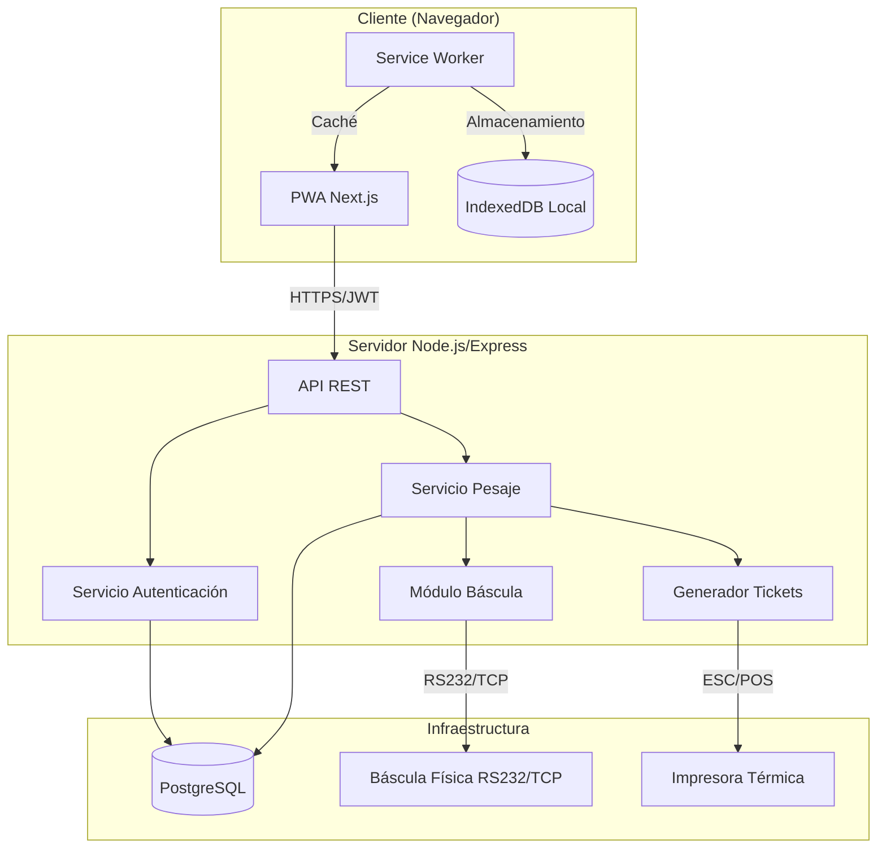
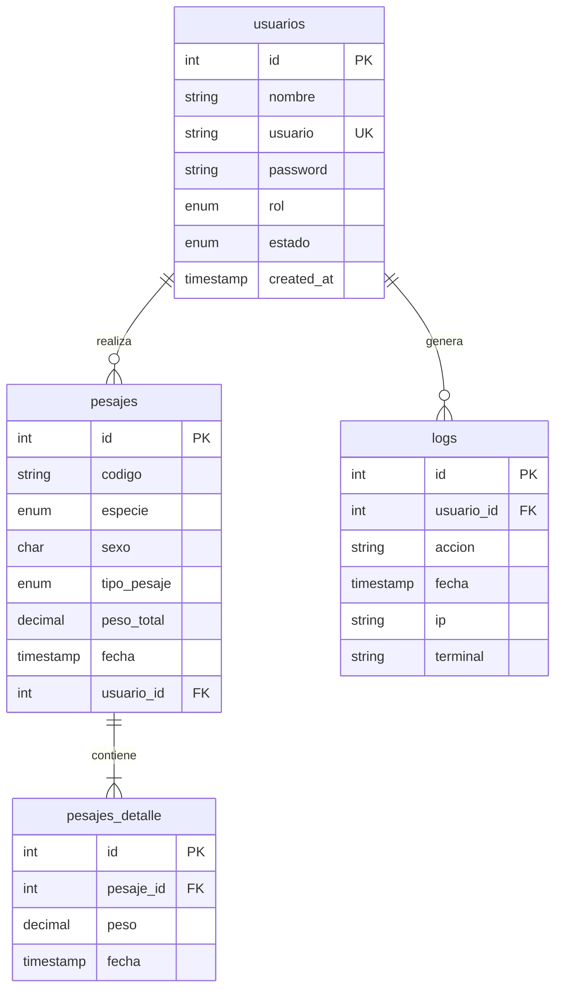

# Documento de Diseño - SAPID

## Overview

El Sistema Automatizado de Pesaje e Integración Digital (SAPID) es una aplicación web monolítica modular diseñada para automatizar el proceso de pesaje de semovientes en Frigorífico Jongovito S.A. El sistema elimina la transcripción manual mediante integración directa con báscula física, proporciona capacidad offline-first para garantizar continuidad operativa, y genera trazabilidad digital completa de todas las operaciones.

### Objetivos del Sistema

- Capturar peso automáticamente desde báscula física vía RS232/TCP
- Eliminar errores de transcripción manual
- Garantizar operación continua incluso sin conexión a internet (PWA offline-first)
- Proporcionar trazabilidad completa con logs de auditoría
- Generar tickets térmicos automáticos
- Soportar dos modalidades de pesaje: individual (Medios) y acumulativo (Lotes)

### Alcance

El sistema cubre:
- Autenticación de usuarios con roles (Administrador/Funcionario)
- Captura automatizada de peso desde báscula física
- Validación de metadatos obligatorios (Código, Especie, Sexo)
- Cálculo automático de pesos consolidados
- Persistencia en PostgreSQL con sincronización offline
- Generación de tickets térmicos de 80mm
- Logs de auditoría centralizados

El sistema NO cubre:
- Gestión de inventario de animales
- Integración con sistemas contables externos
- Reportes analíticos avanzados (fuera del alcance inicial)
- Gestión de proveedores o clientes

## Architecture

### Architectural Style


Arquitectura monolítica modular con separación clara de responsabilidades. El sistema se estructura en 5 módulos principales que interactúan a través de interfaces bien definidas.

**Justificación:** La arquitectura monolítica es apropiada para este contexto debido a:
- Equipo de desarrollo pequeño
- Despliegue en un único entorno (frigorífico)
- Requisitos de latencia estrictos (<2s para captura)
- Simplicidad operativa para el cliente

La modularidad permite evolución futura hacia microservicios si el negocio escala.

### High-Level Architecture Diagram



### Technology Stack


**Backend:**
- Runtime: Node.js (LTS v18+)
- Framework: Express.js
- Base de datos: PostgreSQL 14+
- ORM: Sequelize o Prisma
- Autenticación: JWT (jsonwebtoken)
- Comunicación serial: serialport (npm)
- Comunicación TCP: net (Node.js nativo)

**Frontend:**
- Framework: Next.js 14+ (App Router)
- UI: React 18+
- Estilos: Tailwind CSS
- PWA: next-pwa
- Almacenamiento local: IndexedDB (via idb library)
- Estado: React Context API o Zustand

**Infraestructura:**
- Base de datos: PostgreSQL 14+
- Impresión: ESC/POS protocol (node-thermal-printer)
- Despliegue: Docker + Docker Compose (recomendado)

## Components and Interfaces

### Module 1: Módulo de Autenticación

**Responsabilidad:** Gestionar autenticación de usuarios, validación de credenciales, generación de tokens JWT y control de acceso basado en roles.

**Componentes:**
- `AuthController`: Maneja endpoints de login/logout
- `AuthService`: Lógica de validación de credenciales
- `JWTMiddleware`: Valida tokens en requests protegidos
- `RoleGuard`: Verifica permisos según rol de usuario

**Interfaces:**

```typescript
interface AuthService {
  login(username: string, password: string): Promise<AuthResponse>
  validateToken(token: string): Promise<UserPayload>
  logout(token: string): Promise<void>
}

interface AuthResponse {
  success: boolean
  token?: string
  user?: {
    id: number
    nombre: string
    rol: 'administrador' | 'funcionario'
  }
  error?: string
}

interface UserPayload {
  id: number
  nombre: string
  rol: 'administrador' | 'funcionario'
  iat: number
  exp: number
}
```


### Module 2: Módulo de Integración con Báscula

**Responsabilidad:** Gestionar comunicación con báscula física, leer valores de peso, manejar errores de conexión y validar datos recibidos.

**Componentes:**
- `ScaleAdapter`: Interfaz abstracta para diferentes protocolos
- `RS232Adapter`: Implementación para comunicación serial
- `TCPAdapter`: Implementación para comunicación TCP/IP
- `ScaleParser`: Parsea respuestas según fabricante
- `ScaleService`: Orquesta lectura y validación

**Interfaces:**

```typescript
interface ScaleAdapter {
  connect(): Promise<void>
  disconnect(): Promise<void>
  readWeight(): Promise<number>
  isConnected(): boolean
}

interface ScaleService {
  captureWeight(): Promise<WeightReading>
  getConnectionStatus(): ConnectionStatus
}

interface WeightReading {
  value: number // en kilogramos
  timestamp: Date
  valid: boolean
  error?: string
}

interface ConnectionStatus {
  connected: boolean
  protocol: 'RS232' | 'TCP'
  lastRead?: Date
}
```

**Configuración:**
```typescript
interface ScaleConfig {
  protocol: 'RS232' | 'TCP'
  // Para RS232
  port?: string // ej: '/dev/ttyUSB0' o 'COM3'
  baudRate?: number // ej: 9600
  dataBits?: 7 | 8
  stopBits?: 1 | 2
  parity?: 'none' | 'even' | 'odd'
  // Para TCP
  host?: string
  tcpPort?: number
  // Común
  timeout?: number // milisegundos
  manufacturer?: string // para parser específico
}
```


### Module 3: Módulo de Lógica de Negocio (Pesaje)

**Responsabilidad:** Orquestar el proceso de pesaje, validar metadatos, calcular pesos consolidados, gestionar sesiones de pesaje.

**Componentes:**
- `PesajeController`: Endpoints REST para operaciones de pesaje
- `PesajeService`: Lógica de negocio de pesaje
- `ValidationService`: Valida metadatos obligatorios
- `CalculationService`: Calcula pesos consolidados

**Interfaces:**

```typescript
interface PesajeService {
  createSession(metadata: PesajeMetadata): Promise<PesajeSession>
  addWeightCapture(sessionId: string, weight: number): Promise<void>
  finalizeSession(sessionId: string): Promise<PesajeRecord>
  getHistory(filters: HistoryFilters): Promise<PesajeRecord[]>
}

interface PesajeMetadata {
  codigo: string
  especie: 'bovino' | 'porcino'
  sexo: 'H' | 'M'
  tipoPesaje: 'medios' | 'lotes'
}

interface PesajeSession {
  id: string
  metadata: PesajeMetadata
  capturas: WeightCapture[]
  pesoTotal: number
  estado: 'activa' | 'finalizada'
  usuarioId: number
  createdAt: Date
}

interface WeightCapture {
  peso: number
  timestamp: Date
}

interface PesajeRecord {
  id: number
  codigo: string
  especie: 'bovino' | 'porcino'
  sexo: 'H' | 'M'
  tipoPesaje: 'medios' | 'lotes'
  pesoTotal: number
  fecha: Date
  usuarioId: number
  detalles: WeightCapture[]
}

interface HistoryFilters {
  fechaInicio?: Date
  fechaFin?: Date
  especie?: 'bovino' | 'porcino'
  usuarioId?: number
  limit?: number
  offset?: number
}
```


### Module 4: Módulo de Generación de Tickets

**Responsabilidad:** Formatear y enviar tickets térmicos a impresora ESC/POS.

**Componentes:**
- `TicketGenerator`: Genera formato de ticket
- `PrinterService`: Envía comandos ESC/POS a impresora
- `TicketTemplate`: Plantillas para Medios y Lotes

**Interfaces:**

```typescript
interface TicketGenerator {
  generateTicket(pesaje: PesajeRecord, usuario: string): Promise<TicketData>
  print(ticket: TicketData): Promise<PrintResult>
}

interface TicketData {
  header: string[]
  body: string[]
  footer: string[]
  rawCommands?: Buffer // comandos ESC/POS
}

interface PrintResult {
  success: boolean
  error?: string
  timestamp: Date
}

interface PrinterConfig {
  type: 'network' | 'usb' | 'serial'
  interface: string // IP, puerto USB, o puerto serial
  width: number // caracteres por línea (típicamente 48 para 80mm)
  encoding?: string // 'cp437', 'utf8', etc.
}
```

**Formato de Ticket (80mm):**
```
================================================
        FRIGORÍFICO JONGOVITO S.A.
================================================
Fecha: 2024-01-15 14:30:25
ID Transacción: 00001234
------------------------------------------------
Código: BOV-2024-001
Especie: Bovino
Sexo: Hembra
Tipo: Factura de Medios
------------------------------------------------
DETALLE DE PESOS:
  Captura 1:        450.50 kg
  Captura 2:        455.00 kg
------------------------------------------------
PESO TOTAL:         905.50 kg
------------------------------------------------
Operador: Juan Pérez
================================================
```


### Module 5: Módulo de Persistencia

**Responsabilidad:** Gestionar acceso a base de datos PostgreSQL, transacciones, logs de auditoría.

**Componentes:**
- `DatabaseService`: Conexión y configuración de BD
- `UsuarioRepository`: CRUD de usuarios
- `PesajeRepository`: CRUD de pesajes
- `LogRepository`: Registro de auditoría
- `SyncService`: Sincronización de datos offline

**Interfaces:**

```typescript
interface Repository<T> {
  create(data: Partial<T>): Promise<T>
  findById(id: number): Promise<T | null>
  findAll(filters?: any): Promise<T[]>
  update(id: number, data: Partial<T>): Promise<T>
  delete(id: number): Promise<void>
}

interface PesajeRepository extends Repository<PesajeRecord> {
  createWithDetails(pesaje: PesajeRecord, detalles: WeightCapture[]): Promise<PesajeRecord>
  findByDateRange(inicio: Date, fin: Date): Promise<PesajeRecord[]>
  findByUsuario(usuarioId: number): Promise<PesajeRecord[]>
}

interface LogRepository {
  log(entry: LogEntry): Promise<void>
  findByUsuario(usuarioId: number, limit?: number): Promise<LogEntry[]>
  findByDateRange(inicio: Date, fin: Date): Promise<LogEntry[]>
}

interface LogEntry {
  id?: number
  usuarioId: number
  accion: string
  fecha: Date
  ip?: string
  terminal?: string
}

interface SyncService {
  syncPendingRecords(): Promise<SyncResult>
  getPendingCount(): Promise<number>
  markAsSynced(localId: string): Promise<void>
}

interface SyncResult {
  synced: number
  failed: number
  errors: string[]
}
```


### Module 6: Frontend PWA (Next.js)

**Responsabilidad:** Interfaz de usuario, gestión de estado, almacenamiento local, sincronización offline.

**Componentes:**
- `LoginPage`: Pantalla de autenticación
- `DashboardPage`: Panel principal según rol
- `PesajeForm`: Formulario de captura de pesaje
- `HistoryView`: Consulta de historial
- `OfflineManager`: Gestión de modo offline
- `SyncManager`: Sincronización automática

**Estructura de páginas:**
```
/login                    - Autenticación
/dashboard                - Panel principal
/pesaje/nuevo             - Nuevo pesaje
/pesaje/historial         - Historial de pesajes
/admin/usuarios           - Gestión de usuarios (solo admin)
/admin/logs               - Logs de auditoría (solo admin)
```

**Estado de la aplicación:**
```typescript
interface AppState {
  user: UserPayload | null
  isAuthenticated: boolean
  isOnline: boolean
  currentSession: PesajeSession | null
  pendingSyncs: number
}

interface PesajeFormState {
  metadata: PesajeMetadata
  capturas: WeightCapture[]
  pesoTotal: number
  isCapturing: boolean
  errors: Record<string, string>
}
```

**Service Worker:**
- Caché de recursos estáticos (HTML, CSS, JS, imágenes)
- Estrategia: Cache-First para assets, Network-First para API
- Background Sync para sincronización de pesajes pendientes
- Notificaciones de estado de conexión


## Data Models

### Database Schema

```sql
-- Tabla de usuarios
CREATE TABLE usuarios (
  id SERIAL PRIMARY KEY,
  nombre VARCHAR(100) NOT NULL,
  usuario VARCHAR(50) UNIQUE NOT NULL,
  password VARCHAR(255) NOT NULL, -- Hash bcrypt
  rol VARCHAR(20) NOT NULL CHECK (rol IN ('administrador', 'funcionario')),
  estado VARCHAR(20) NOT NULL DEFAULT 'activo' CHECK (estado IN ('activo', 'inactivo')),
  created_at TIMESTAMP DEFAULT CURRENT_TIMESTAMP
);

-- Tabla de pesajes (sesiones)
CREATE TABLE pesajes (
  id SERIAL PRIMARY KEY,
  codigo VARCHAR(50) NOT NULL,
  especie VARCHAR(20) NOT NULL CHECK (especie IN ('bovino', 'porcino')),
  sexo CHAR(1) NOT NULL CHECK (sexo IN ('H', 'M')),
  tipo_pesaje VARCHAR(20) NOT NULL CHECK (tipo_pesaje IN ('medios', 'lotes')),
  peso_total DECIMAL(10,2) NOT NULL,
  fecha TIMESTAMP DEFAULT CURRENT_TIMESTAMP,
  usuario_id INTEGER NOT NULL REFERENCES usuarios(id),
  INDEX idx_fecha (fecha),
  INDEX idx_usuario (usuario_id),
  INDEX idx_codigo (codigo)
);

-- Tabla de detalles de pesaje (capturas individuales)
CREATE TABLE pesajes_detalle (
  id SERIAL PRIMARY KEY,
  pesaje_id INTEGER NOT NULL REFERENCES pesajes(id) ON DELETE CASCADE,
  peso DECIMAL(10,2) NOT NULL,
  fecha TIMESTAMP DEFAULT CURRENT_TIMESTAMP,
  INDEX idx_pesaje (pesaje_id)
);

-- Tabla de logs de auditoría
CREATE TABLE logs (
  id SERIAL PRIMARY KEY,
  usuario_id INTEGER REFERENCES usuarios(id),
  accion VARCHAR(255) NOT NULL,
  fecha TIMESTAMP DEFAULT CURRENT_TIMESTAMP,
  ip VARCHAR(45),
  terminal VARCHAR(100),
  INDEX idx_usuario (usuario_id),
  INDEX idx_fecha (fecha)
);
```

### Entity Relationships




### Data Validation Rules

**Usuarios:**
- `nombre`: 1-100 caracteres, no vacío
- `usuario`: 3-50 caracteres, alfanumérico, único
- `password`: mínimo 8 caracteres, hash bcrypt con factor 10
- `rol`: debe ser 'administrador' o 'funcionario'
- `estado`: debe ser 'activo' o 'inactivo'

**Pesajes:**
- `codigo`: 1-50 caracteres, no vacío, formato libre
- `especie`: debe ser 'bovino' o 'porcino'
- `sexo`: debe ser 'H' o 'M'
- `tipo_pesaje`: debe ser 'medios' o 'lotes'
- `peso_total`: > 0, máximo 2 decimales, rango razonable (10-2000 kg)
- `usuario_id`: debe existir en tabla usuarios

**Pesajes_detalle:**
- `peso`: > 0, máximo 2 decimales
- `pesaje_id`: debe existir en tabla pesajes

**Logs:**
- `accion`: 1-255 caracteres, no vacío
- `ip`: formato IPv4 o IPv6 válido (opcional)
- `terminal`: 1-100 caracteres (opcional)

### IndexedDB Schema (Offline Storage)

```typescript
// Base de datos local para modo offline
interface OfflineDB {
  name: 'sapid-offline'
  version: 1
  stores: {
    pendingPesajes: {
      key: string // UUID generado localmente
      value: {
        metadata: PesajeMetadata
        capturas: WeightCapture[]
        pesoTotal: number
        usuarioId: number
        createdAt: Date
        synced: boolean
      }
    }
    cachedData: {
      key: string
      value: any
      timestamp: Date
    }
  }
}
```


## Correctness Properties

*A property is a characteristic or behavior that should hold true across all valid executions of a system-essentially, a formal statement about what the system should do. Properties serve as the bridge between human-readable specifications and machine-verifiable correctness guarantees.*

### Property Reflection

Después de analizar todos los criterios de aceptación testables, he identificado las siguientes redundancias y consolidaciones:

**Consolidaciones realizadas:**
- RF04.1, RF04.2, RF04.3 se consolidan en una sola propiedad sobre validación de metadatos completos
- RF05.1, RF05.2, RF05.3 se consolidan en una propiedad sobre cálculo incremental correcto
- RNF04.1, RNF04.2, RNF04.3 se consolidan en una propiedad sobre logging de todas las operaciones críticas
- RNF05.2, RNF05.6 se consolidan en una propiedad sobre funcionalidad completa offline

**Propiedades eliminadas por redundancia:**
- RF04.4 es redundante con la consolidación de RF04.1-RF04.3
- RF05.3 es redundante con RF05.1 (mostrar es consecuencia de calcular)

### Authentication Properties

### Property 1: Valid credentials grant access with correct role

*For any* user with valid credentials and active status in the database, authenticating should return a successful response with a JWT token containing the correct role (administrador or funcionario).

**Validates: Requirements RF01.1, RF01.5**

### Property 2: Invalid credentials are rejected

*For any* combination of username and password that does not match an active user in the database, the authentication service should reject the login attempt with an "Credenciales inválidas" message.

**Validates: Requirements RF01.2**

### Property 3: Empty credential fields are validated

*For any* login attempt where username or password is empty or contains only whitespace, the system should reject the attempt and request completion of required fields.

**Validates: Requirements RF01.3**

### Property 4: Inactive users cannot authenticate

*For any* user with estado='inactivo' in the database, authentication attempts should be denied regardless of correct credentials.

**Validates: Requirements RF01.4**


### Scale Integration Properties

### Property 5: Weight capture returns valid readings

*For any* capture request when the scale is connected and stable, the Módulo_Báscula should return a positive weight value within the valid range (10-2000 kg) with maximum 2 decimal places.

**Validates: Requirements RF02.1, RF02.2**

### Property 6: Communication errors are reported

*For any* capture attempt when the scale is disconnected or communication fails, the Módulo_Báscula should return an error indicating connection failure without crashing.

**Validates: Requirements RF02.3**

### Property 7: Invalid weight values are rejected

*For any* weight reading that is zero, negative, or outside the valid range, the system should reject the value and request a new reading.

**Validates: Requirements RF02.4**

### Weighing Session Properties

### Property 8: Complete metadata enables weight capture

*For any* weighing session, the capture button should be enabled if and only if all required metadata fields (codigo, especie, sexo) are non-empty and valid.

**Validates: Requirements RF03.3, RF04.1, RF04.2, RF04.3, RF04.4**

### Property 9: Template selection persists during session

*For any* weighing session, once a template type (medios or lotes) is selected, it should remain unchanged until the session is finalized or cancelled.

**Validates: Requirements RF03.5**

### Property 10: Metadata changes update ticket preview

*For any* change to metadata fields (codigo, especie, sexo), the ticket preview should automatically update to reflect the new values.

**Validates: Requirements RF03.4**


### Calculation Properties

### Property 11: Weight total is sum of all captures

*For any* weighing session with multiple weight captures, the peso_total should always equal the sum of all individual peso values in the capturas array, maintaining precision to 2 decimal places.

**Validates: Requirements RF05.1, RF05.2, RF05.5**

### Property 12: Adding capture updates total incrementally

*For any* weighing session, when a new weight capture is added, the peso_total should increase by exactly the value of the new capture (within floating-point precision tolerance of 0.01).

**Validates: Requirements RF05.2**

### Property 13: Finalized session persists calculated total

*For any* weighing session that is finalized, the peso_total stored in the database should match the sum of all peso values in the pesajes_detalle table for that pesaje_id.

**Validates: Requirements RF05.4**

### Finalization and Printing Properties

### Property 14: Complete sessions enable finalization

*For any* weighing session, the "Finalizar e Imprimir" button should be enabled if and only if at least one weight capture has been recorded and all metadata is complete.

**Validates: Requirements RF06.1**

### Property 15: Finalized sessions have unique IDs and timestamps

*For any* two distinct finalized weighing sessions, they should have different unique IDs, and each should have a timestamp recording when it was created.

**Validates: Requirements RF06.2**

### Property 16: Successful save triggers print command

*For any* weighing session that is successfully saved to the database, a print command should be sent to the thermal printer with all required ticket fields.

**Validates: Requirements RF06.3**


### Property 17: Generated tickets contain all required fields

*For any* finalized weighing session, the generated ticket should contain: codigo, especie, sexo, tipo_pesaje, peso_total, fecha, and operator name (usuario.nombre).

**Validates: Requirements RF06.4**

### Property 18: Database errors preserve session data

*For any* weighing session where database save fails, the session data should remain in memory or local storage, allowing retry without data loss.

**Validates: Requirements RF06.5**

### Property 19: Database persistence is independent of printer status

*For any* weighing session, successful database persistence should occur regardless of whether the thermal printer is available or responds successfully.

**Validates: Requirements RF06.6**

### Security Properties

### Property 20: Passwords are hashed with bcrypt

*For any* user record in the database, the password field should contain a bcrypt hash (starting with "$2a$", "$2b$", or "$2y$") with work factor >= 10, never plaintext.

**Validates: Requirements RNF02.2, RNF02.5**

### Property 21: Session tokens expire after inactivity

*For any* JWT token generated by the system, it should have an expiration time (exp claim) set to maximum 8 hours from issuance, and expired tokens should be rejected.

**Validates: Requirements RNF02.3**

### Property 22: User inputs are sanitized

*For any* user input received by the system (form fields, query parameters), special characters that could enable SQL injection or XSS attacks should be escaped or rejected before processing.

**Validates: Requirements RNF02.4**


### Usability Properties

### Property 23: Keyboard navigation is complete

*For any* user interface screen in the system, all interactive elements should be reachable and operable using only keyboard input (Tab, Enter, Arrow keys, Escape).

**Validates: Requirements RNF03.2**

### Property 24: Mouse navigation is complete

*For any* user interface screen in the system, all functionality should be accessible and operable using only mouse input (click, double-click, scroll).

**Validates: Requirements RNF03.3**

### Audit Logging Properties

### Property 25: Critical operations are logged

*For any* critical operation (successful authentication, weighing session creation, user modification), a log entry should be created in the logs table with usuario_id, accion, fecha, ip, and terminal.

**Validates: Requirements RNF04.1, RNF04.2, RNF04.3, RNF04.4**

### Property 26: Administrators can access all logs

*For any* user with rol='administrador', the system should allow querying and exporting log entries, while users with rol='funcionario' should not have access to logs.

**Validates: Requirements RNF04.6**

### Offline Resilience Properties

### Property 27: Offline mode enables local capture

*For any* weighing session initiated when network connectivity is unavailable, the system should allow complete weight capture and store the session in IndexedDB local storage.

**Validates: Requirements RNF05.2, RNF05.6**


### Property 28: Offline-to-online synchronization (Round-trip)

*For any* weighing session stored locally in IndexedDB while offline, when network connectivity is restored, the session should be automatically synchronized to the PostgreSQL database and the local record should be marked as synced.

**Validates: Requirements RNF05.3**

### Property 29: Offline status is visible to user

*For any* time when network connectivity is unavailable, the system should display a clear visual indicator (banner, icon, or message) informing the user that the system is operating in offline mode.

**Validates: Requirements RNF05.4**

### Property 30: Static resources are cached

*For any* static resource (HTML, CSS, JavaScript, images) required by the PWA, it should be available in the service worker cache, allowing the application to load without network connectivity.

**Validates: Requirements RNF05.5**

### Property 31: Sync conflicts resolve by timestamp

*For any* synchronization conflict where the same weighing session exists both locally and on the server with different values, the system should keep the version with the most recent timestamp (fecha field).

**Validates: Requirements RNF05.7**

## Error Handling

### Error Categories

The system handles four main categories of errors:

1. **Validation Errors**: Invalid user input, missing required fields
2. **Integration Errors**: Scale communication failures, printer unavailability
3. **Persistence Errors**: Database connection failures, transaction rollbacks
4. **Network Errors**: Loss of connectivity, timeout errors


### Error Handling Strategies

**Validation Errors:**
- Display clear, user-friendly error messages in Spanish
- Highlight invalid fields in the UI (red border, error text)
- Prevent form submission until all validations pass
- Never expose technical details to end users

**Integration Errors (Scale):**
- Retry connection automatically (max 3 attempts with exponential backoff)
- Display connection status indicator
- Allow manual retry via "Reintentar" button
- Log all communication errors for debugging
- Gracefully degrade: allow manual weight entry as fallback (admin-configurable)

**Integration Errors (Printer):**
- Attempt print but don't block database save
- Display warning if print fails: "Pesaje guardado, pero no se pudo imprimir"
- Store print queue for retry
- Allow reprint from history view

**Persistence Errors:**
- Catch all database exceptions
- Display user-friendly message: "Error al guardar. Verifique la conexión"
- Preserve session data in memory
- Enable retry without data loss
- If offline: automatically switch to IndexedDB storage

**Network Errors:**
- Detect connectivity loss via navigator.onLine and fetch timeouts
- Automatically switch to offline mode
- Queue all operations for later sync
- Display offline indicator
- Auto-sync when connectivity restored

### Error Response Format

All API errors follow a consistent format:

```typescript
interface ErrorResponse {
  success: false
  error: {
    code: string // Machine-readable error code
    message: string // User-friendly Spanish message
    details?: any // Optional technical details (dev mode only)
    timestamp: Date
  }
}
```

**Error Codes:**
- `AUTH_INVALID_CREDENTIALS`: Credenciales inválidas
- `AUTH_USER_INACTIVE`: Usuario inactivo
- `AUTH_TOKEN_EXPIRED`: Sesión expirada
- `VALIDATION_REQUIRED_FIELD`: Campo obligatorio faltante
- `VALIDATION_INVALID_VALUE`: Valor inválido
- `SCALE_CONNECTION_ERROR`: Error de conexión con báscula
- `SCALE_INVALID_READING`: Lectura de peso inválida
- `PRINTER_UNAVAILABLE`: Impresora no disponible
- `DB_CONNECTION_ERROR`: Error de conexión a base de datos
- `DB_TRANSACTION_ERROR`: Error en transacción
- `NETWORK_TIMEOUT`: Tiempo de espera agotado
- `NETWORK_OFFLINE`: Sin conexión a internet


### Logging Strategy

All errors are logged with appropriate severity levels:

```typescript
enum LogLevel {
  ERROR = 'error',   // System failures requiring immediate attention
  WARN = 'warn',     // Degraded functionality but system operational
  INFO = 'info',     // Normal operations and state changes
  DEBUG = 'debug'    // Detailed diagnostic information
}

interface LogEntry {
  level: LogLevel
  timestamp: Date
  message: string
  context: {
    userId?: number
    sessionId?: string
    component: string // 'auth', 'scale', 'pesaje', 'printer', 'db'
    action: string
    ip?: string
    terminal?: string
  }
  error?: {
    name: string
    message: string
    stack?: string
  }
}
```

**Logging Rules:**
- ERROR: Database failures, unhandled exceptions, authentication failures
- WARN: Scale communication issues, printer unavailable, validation failures
- INFO: Successful logins, weighing sessions created/finalized, sync operations
- DEBUG: Scale readings, API requests, state transitions (dev mode only)

## Testing Strategy

### Dual Testing Approach

The SAPID system requires comprehensive testing using both unit tests and property-based tests:

**Unit Tests** focus on:
- Specific examples demonstrating correct behavior
- Edge cases (empty inputs, boundary values, special characters)
- Error conditions and exception handling
- Integration points between modules
- UI component rendering and interactions

**Property-Based Tests** focus on:
- Universal properties that hold for all valid inputs
- Comprehensive input coverage through randomization
- Invariants that must be maintained across operations
- Round-trip properties (serialize/deserialize, offline/online sync)
- Mathematical properties (sum calculations, precision)

Both approaches are complementary and necessary for comprehensive coverage.


### Property-Based Testing Configuration

**Library Selection:**
- **Backend (Node.js)**: fast-check (https://github.com/dubzzz/fast-check)
- **Frontend (React/Next.js)**: fast-check + @testing-library/react

**Configuration:**
- Minimum 100 iterations per property test (due to randomization)
- Seed-based reproducibility for failed tests
- Shrinking enabled to find minimal failing examples
- Timeout: 10 seconds per property test

**Test Tagging:**
Each property test must reference its design document property using this format:

```typescript
// Feature: sapid-weighing-system, Property 1: Valid credentials grant access with correct role
test('valid credentials grant access with correct role', () => {
  fc.assert(
    fc.property(
      fc.record({
        username: fc.string({ minLength: 3, maxLength: 50 }),
        password: fc.string({ minLength: 8 }),
        rol: fc.constantFrom('administrador', 'funcionario'),
        estado: fc.constant('activo')
      }),
      async (user) => {
        // Test implementation
      }
    ),
    { numRuns: 100 }
  )
})
```

### Unit Testing Strategy

**Backend Testing:**
- Framework: Jest
- Coverage target: 80% line coverage minimum
- Focus areas:
  - AuthService: Login flows, token validation, role checks
  - PesajeService: Session management, calculations, validations
  - ScaleAdapter: Connection handling, parsing, error recovery
  - TicketGenerator: Format generation, field inclusion
  - Repositories: CRUD operations, transactions

**Frontend Testing:**
- Framework: Jest + @testing-library/react
- Coverage target: 70% line coverage minimum
- Focus areas:
  - LoginPage: Form validation, error display
  - PesajeForm: Metadata validation, capture flow, total calculation
  - OfflineManager: Connectivity detection, local storage
  - SyncManager: Synchronization logic, conflict resolution


**Example Unit Tests:**

```typescript
// Example: Edge case for empty credentials
describe('AuthService', () => {
  test('should reject empty username', async () => {
    const result = await authService.login('', 'password123')
    expect(result.success).toBe(false)
    expect(result.error).toContain('Complete todos los campos')
  })

  test('should reject whitespace-only password', async () => {
    const result = await authService.login('user1', '   ')
    expect(result.success).toBe(false)
    expect(result.error).toContain('Complete todos los campos')
  })
})

// Example: Specific calculation test
describe('PesajeService', () => {
  test('should calculate total for two captures', async () => {
    const session = await pesajeService.createSession({
      codigo: 'BOV-001',
      especie: 'bovino',
      sexo: 'H',
      tipoPesaje: 'medios'
    })
    
    await pesajeService.addWeightCapture(session.id, 450.50)
    await pesajeService.addWeightCapture(session.id, 455.00)
    
    const updated = await pesajeService.getSession(session.id)
    expect(updated.pesoTotal).toBe(905.50)
  })
})
```

### Integration Testing

**API Integration Tests:**
- Framework: Supertest + Jest
- Test complete request/response cycles
- Use test database (PostgreSQL in Docker)
- Mock external dependencies (scale, printer)
- Test authentication middleware
- Test error responses

**Database Integration Tests:**
- Use test database with migrations
- Test transactions and rollbacks
- Test foreign key constraints
- Test concurrent operations
- Clean database between tests

**Scale Integration Tests:**
- Mock serial port and TCP connections
- Test different manufacturer protocols
- Test timeout and retry logic
- Test connection recovery


### End-to-End Testing

**Framework:** Playwright or Cypress

**Critical User Flows:**
1. Login flow (valid/invalid credentials)
2. Complete weighing session (Medios template)
3. Complete weighing session (Lotes template)
4. Offline capture and sync
5. Print ticket and handle printer error
6. Admin user management
7. View weighing history

**E2E Test Environment:**
- Full stack running (backend + frontend + database)
- Mock scale and printer
- Test both online and offline scenarios
- Test on different browsers (Chrome, Firefox, Edge)

### Test Data Generators

For property-based testing, we need generators for domain objects:

```typescript
// fast-check generators
const genUsuario = fc.record({
  nombre: fc.string({ minLength: 1, maxLength: 100 }),
  usuario: fc.string({ minLength: 3, maxLength: 50 }),
  password: fc.string({ minLength: 8 }),
  rol: fc.constantFrom('administrador', 'funcionario'),
  estado: fc.constantFrom('activo', 'inactivo')
})

const genPesajeMetadata = fc.record({
  codigo: fc.string({ minLength: 1, maxLength: 50 }),
  especie: fc.constantFrom('bovino', 'porcino'),
  sexo: fc.constantFrom('H', 'M'),
  tipoPesaje: fc.constantFrom('medios', 'lotes')
})

const genPeso = fc.double({ min: 10, max: 2000, noNaN: true })
  .map(n => Math.round(n * 100) / 100) // 2 decimals

const genWeightCapture = fc.record({
  peso: genPeso,
  timestamp: fc.date()
})

const genPesajeSession = fc.record({
  metadata: genPesajeMetadata,
  capturas: fc.array(genWeightCapture, { minLength: 1, maxLength: 10 }),
  usuarioId: fc.integer({ min: 1, max: 1000 })
})
```

### Continuous Integration

**CI Pipeline (GitHub Actions / GitLab CI):**
1. Lint code (ESLint, Prettier)
2. Type check (TypeScript)
3. Run unit tests (Jest)
4. Run property-based tests (fast-check)
5. Run integration tests (with test DB)
6. Generate coverage report
7. Build Docker images
8. Run E2E tests (Playwright)

**Quality Gates:**
- All tests must pass
- Code coverage >= 80% (backend), >= 70% (frontend)
- No TypeScript errors
- No ESLint errors
- No security vulnerabilities (npm audit)

### Manual Testing Checklist

Before deployment, manually verify:
- [ ] Physical scale connection (RS232 and TCP)
- [ ] Thermal printer functionality
- [ ] Offline mode activation and sync
- [ ] Token expiration after 8 hours
- [ ] All error messages in Spanish
- [ ] Keyboard navigation complete
- [ ] Mouse navigation complete
- [ ] Responsive design on target resolution (1024x768+)
- [ ] PWA installation on Chrome/Edge
- [ ] Service worker caching
- [ ] Database backup and restore

---

## Implementation Notes

### Deployment Architecture

**Recommended Setup:**
```
┌─────────────────────────────────────┐
│  Frigorífico Network                │
│                                     │
│  ┌──────────────┐                  │
│  │  Server PC   │                  │
│  │  - Docker    │                  │
│  │  - PostgreSQL│                  │
│  │  - Node.js   │                  │
│  │  - Next.js   │                  │
│  └──────┬───────┘                  │
│         │                           │
│  ┌──────┴───────┬─────────────┐   │
│  │              │             │   │
│  ▼              ▼             ▼   │
│ Client 1     Client 2     Client 3│
│ (Browser)    (Browser)   (Browser)│
│                                     │
│  Scale ──RS232──▶ Server           │
│  Printer ──USB──▶ Server           │
└─────────────────────────────────────┘
```

### Security Considerations

- Use HTTPS in production (Let's Encrypt certificate)
- Implement rate limiting on login endpoint (max 5 attempts per minute)
- Use prepared statements for all SQL queries (prevent injection)
- Sanitize all user inputs
- Set secure HTTP headers (HSTS, CSP, X-Frame-Options)
- Regular security updates for dependencies
- Database backups encrypted at rest
- Audit logs immutable (append-only)

### Performance Optimization

- Database indexes on frequently queried fields (fecha, usuario_id, codigo)
- Connection pooling for PostgreSQL (max 20 connections)
- API response caching for static data (user profiles)
- Lazy loading for history views (pagination)
- Service worker caching for static assets
- Compress API responses (gzip)
- Optimize images and assets
- Monitor query performance (log slow queries > 1s)

### Monitoring and Observability

**Metrics to track:**
- API response times (p50, p95, p99)
- Database query times
- Scale communication success rate
- Printer success rate
- Offline sync success rate
- Active user sessions
- Error rates by type
- PWA installation rate

**Logging:**
- Centralized logging (Winston + file rotation)
- Structured JSON logs
- Log retention: 12 months minimum
- Daily log rotation
- Error alerting (email/SMS for critical errors)

### Maintenance Procedures

**Daily:**
- Monitor error logs
- Check scale connectivity
- Verify printer status

**Weekly:**
- Database backup verification
- Review audit logs
- Check disk space

**Monthly:**
- Security updates
- Performance review
- User feedback review

**Quarterly:**
- Full system backup test
- Disaster recovery drill
- Security audit

---

**Document Version:** 1.0  
**Last Updated:** 2024-01-15  
**Author:** Kiro AI Assistant  
**Status:** Ready for Review
